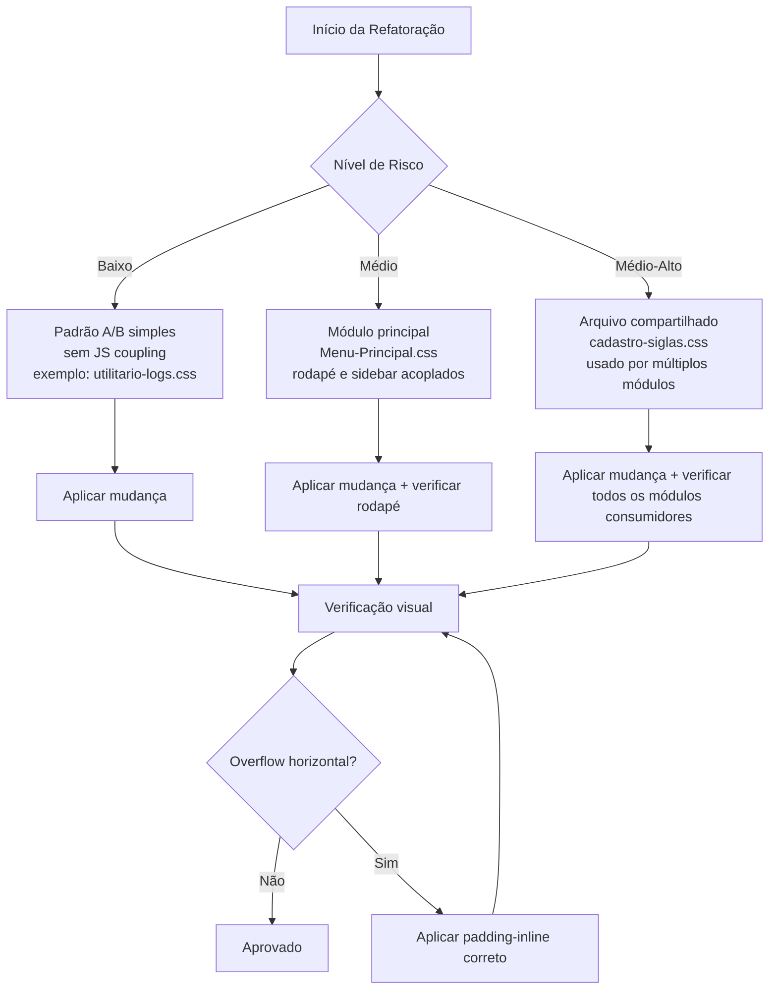

p# Design Técnico — Layout Fluido / Full-Width

> **Feature:** `layout-fluido-full-width`
> **Escopo:** Refatoração CSS-only · Sem alterações em HTML, JavaScript ou estrutura de DOM

---

## Visão Geral

### Problema

O GM4med é composto por mais de 20 módulos independentes. Vários desses módulos impõem restrições de largura máxima estáticas nos seus contêineres de estrutura de página — valores como `max-width: 1800px`, `max-width: 1640px`, `max-width: 1560px` etc. —, o que gera margens laterais brancas excessivas e desperdiça espaço útil em monitores Full HD (1920 px), 4K (3840 px) e ultrawide (2560 px+).

### Solução

Refatoração puramente CSS: remover ou sobrescrever as regras `max-width` / `margin: auto` dos seletores raiz de estrutura de página (chamados aqui de **Contêineres Estruturais**) em exatamente **8 arquivos CSS**, sem tocar em JavaScript, DOM, IDs, atributos `data-*` / `aria-*`, modais, toasts ou a sidebar de 290 px.

### Arquitetura geral

```
Viewport (100vw)
├── .sidebar  [position: fixed; left: 0; width: 290px]   — NÃO TOCADO
└── <main class="main-content ml-[290px]">               — NÃO TOCADO (Tailwind)
    └── Contêiner Estrutural (.app-container / .app / .page / …)
        ANTES: max-width: 1640px; margin: 0 auto;  → gaps laterais
        DEPOIS: width: 100%; max-width: none; margin: 0; → full-width
```

A sidebar (`position: fixed; width: 290px`) e o deslocamento do conteúdo principal (`ml-[290px]`, equivalente a `margin-left: 290px`) já garantem que o conteúdo jamais se sobreponha à barra de navegação. A remoção do `max-width` no contêiner interno é, portanto, a única alteração necessária para o conteúdo preencher toda a área disponível.

### Não-objetivos (fora de escopo)

- Alterar qualquer arquivo `.html` ou `.js`
- Modificar a sidebar (largura, posicionamento, conteúdo)
- Alterar `ml-[290px]` no `<main>` do `Menu-Principal.html`
- Modificar `max-width` de componentes internos (modais, campos de formulário, parágrafos)
- Criar um sistema de design unificado — cada módulo continua com seu CSS próprio
- Atualizar módulos que já operam em full-width (lista na seção Modelos de Dados)

---

## Modelos de Dados

### Registro de Restrições — Antes × Depois

Esta tabela é o contrato formal da refatoração. Cada linha corresponde a uma mudança atômica e rastreável.

| # | Arquivo | Seletor | Propriedades a remover | Estado após mudança |
|---|---------|---------|------------------------|---------------------|
| 1 | `Menu-Principal.css` | `.app-container` | `width: min(100%, 1800px)` · `margin: 0 auto` | `width: 100%; max-width: none; margin: 0;` |
| 2 | `Atendimento-do-paciente-na-recepcao/atendimento-recepcao.css` | `.app` | `max-width: 1560px` · `margin: auto` | `width: 100%; max-width: none; margin: 0;` |
| 3 | `Atendimentos/atendimento.css` | `.atendimento-page` | `max-width: 1400px` · `margin: 0 auto` | `width: 100%; max-width: none; margin: 0; padding: 20px;` |
| 4a | `estilizacao/cadastro-siglas.css` | `.container` (regra base) | `max-width: 1400px` · `margin: auto` | `width: 100%; max-width: none; margin: 0;` |
| 4b | `estilizacao/cadastro-siglas.css` | `.container` em `@media (min-width: 1600px)` | bloco inteiro do seletor `.container` dentro da media query | bloco removido; `html { font-size: 18px; }` preservado |
| 5 | `estilizacao/cadastro-usuario.css` | `.content` | `max-width: 1400px` · `margin: 0 auto` | `padding: 30px 40px; width: 100%; max-width: none; margin: 0;` |
| 6 | `estilizacao/agenda.css` | `.container` | `max-width: 900px` · `margin: 20px auto` | `width: 100%; max-width: none; margin: 0;` · demais regras preservadas |
| 7 | `Relatorios/relatorio-atendimentos.css` | `.page` | `max-width: 1640px` · `margin: 0 auto` | `width: 100%; max-width: none; margin: 0; padding: 24px 28px;` |
| 8 | `Utilitarios/utilitario-logs.css` | `.page` | `max-width: 1600px` · `margin: 0 auto` | `width: 100%; max-width: none; margin: 0; padding: 2rem 1.5rem;` |

### Módulos sem alteração (já full-width ou irrelevantes)

Os módulos abaixo **não possuem `max-width` fixo no contêiner raiz** ou já utilizam `max-width: 100%`. Nenhum arquivo desses módulos deve ser tocado.

| Módulo | Justificativa |
|--------|--------------|
| `Agenda-medica` | `estilizacao/agenda.css` será corrigido (arquivo compartilhado); o HTML do módulo não tem contêiner com max-width |
| `Cadastro-paciente` | Sem max-width estrutural detectado |
| `Cadastros-medicos` | Sem max-width estrutural detectado |
| `Catalogo` | Sem max-width estrutural detectado |
| `convenios` | Já full-width (`max-width: 100%`) |
| `Especialidade-medica-utilitarios` | Já full-width |
| `financeiro` | Layout próprio com grid interno; não afetado pela sidebar global |
| `Grupo-de-atendimento` | Já full-width |
| `Grupo-de-exames` | Já full-width |
| `Grupo-de-procedimentos` | Já full-width (`max-width: 100%` em `main#mainContent`) |
| `Grupo-de-tipos-de-atendimento` | Já full-width (`max-width: 100%` em `main#mainContent`) |
| `Procedimento-médico` | Sem max-width estrutural no contêiner raiz |
| `Siglas` | Já full-width; `max-width` existente é em `.page-title p` (componente interno) |
| `Suporte` | `.main-content` usa `margin-left: 16rem` (sidebar própria); não afetado |
| `Cadastro-de-categoria` / `Cadastro-exame` | Sem max-width estrutural detectado |

### Regras que devem ser preservadas intactas

| Seletor / Elemento | Regra preservada | Motivo |
|--------------------|-----------------|--------|
| `<main class="main-content ml-[290px]">` | Classe Tailwind `ml-[290px]` | Deslocamento da sidebar |
| `<footer class="footer fixed bottom-2.5 left-[290px] w-[calc(100%-290px)]">` | Classes Tailwind do rodapé | Alinhamento com a sidebar |
| `.sidebar` em `Menu-Principal.css` | `width: 290px; position: fixed` | Estrutura da sidebar |
| `.modal-content`, `.modal-card`, `.modal-panel-*` | `max-width` entre 400 px e 900 px | Legibilidade de modais |
| `.toast-container` | `position: fixed; right: 1.25rem; bottom: 1.25rem` | Posicionamento de notificações |
| `html`, `body` | `overflow-x: hidden` | Prevenção de scroll horizontal |
| `@media (max-width: 1024px)` no `Menu-Principal.css` | `.sidebar { transform: translateX(-100%) }` · `.main-content { margin-left: 0 }` | Comportamento mobile da sidebar |

---

## Componentes e Interfaces

### Padrões de Mudança

Existem três padrões de mudança nesta refatoração. Cada arquivo se enquadra em exatamente um deles.

#### Padrão A — Substituição de função `min()`

Aplicável ao `Menu-Principal.css`, onde a restrição de largura usa a função CSS `min()`.

```css
/* ANTES */
.app-container {
    width: min(100%, 1800px);
    margin: 0 auto;
    /* demais propriedades inalteradas */
}

/* DEPOIS */
.app-container {
    width: 100%;
    max-width: none;
    margin: 0;
    /* demais propriedades inalteradas */
}
```

**Regras preservadas no mesmo bloco:** `min-height`, `overflow: hidden`, `border`, `border-radius`, `background`, `box-shadow`.

---

#### Padrão B — Remoção de `max-width` + `margin: auto`

Aplicável a `atendimento-recepcao.css` (`.app`), `atendimento.css` (`.atendimento-page`), `cadastro-siglas.css` (`.container` base), `cadastro-usuario.css` (`.content`), `agenda.css` (`.container`), `relatorio-atendimentos.css` (`.page`), `utilitario-logs.css` (`.page`).

```css
/* ANTES — exemplo genérico */
.seletor-raiz {
    max-width: 1640px;    /* ← REMOVER */
    margin: 0 auto;       /* ← SUBSTITUIR por margin: 0 */
    padding: 24px 28px;   /* preservado */
    /* outras propriedades preservadas */
}

/* DEPOIS */
.seletor-raiz {
    width: 100%;          /* ← ADICIONAR */
    max-width: none;      /* ← SUBSTITUIR */
    margin: 0;            /* ← SUBSTITUIR */
    padding: 24px 28px;   /* preservado */
    /* outras propriedades preservadas */
}
```

---

#### Padrão C — Remoção de override em `@media`

Aplicável exclusivamente a `estilizacao/cadastro-siglas.css`, que redefine `max-width` do `.container` dentro de um bloco `@media (min-width: 1600px)`.

```css
/* ANTES */
@media (min-width: 1600px) {
    .container {
        max-width: 1550px;  /* ← REMOVER este bloco inteiro */
    }

    html {
        font-size: 18px;    /* preservado */
    }
}

/* DEPOIS */
@media (min-width: 1600px) {
    html {
        font-size: 18px;    /* apenas este bloco permanece */
    }
}
```

---

### Escada de Padding Responsivo

Após a remoção das restrições de largura, o conteúdo pode colar nas bordas da tela em viewports estreitas. A escada de padding abaixo deve ser adicionada — ou verificada como já existente — em cada arquivo modificado.

```css
/* Garante box-sizing correto */
.app-container,
.app,
.atendimento-page,
.container,
.content,
.page {
    box-sizing: border-box;
}

/* Viewport < 640px — padding-inline: 1rem (16px) */
@media (max-width: 639px) {
    .app-container,
    .app,
    .atendimento-page,
    .container,
    .content,
    .page {
        padding-inline: 1rem;
    }
}

/* Viewport 640px–1279px — padding-inline: 1.5rem (24px) */
@media (min-width: 640px) and (max-width: 1279px) {
    .app-container,
    .app,
    .atendimento-page,
    .container,
    .content,
    .page {
        padding-inline: 1.5rem;
    }
}

/* Viewport >= 1280px — padding-inline: 2rem (32px) */
@media (min-width: 1280px) {
    .app-container,
    .app,
    .atendimento-page,
    .container,
    .content,
    .page {
        padding-inline: 2rem;
    }
}
```

> **Atenção:** A escada de padding NÃO deve sobrescrever padding-top/bottom que já existam nos contêineres. A propriedade `padding-inline` afeta apenas os eixos esquerdo e direito.
>
> **Verificação por arquivo:** Se um arquivo já define `padding-inline` ou `padding: X Ypx` com valor lateral ≥ 16 px em mobile, o bloco correspondente da escada pode ser omitido para aquele seletor, desde que o valor mínimo seja mantido.

---

### Deslocamento da Sidebar e Rodapé

O deslocamento do conteúdo em relação à sidebar de 290 px é gerenciado **exclusivamente** por Tailwind no HTML, não pelo CSS customizado dos módulos.

```html
<!-- Menu-Principal.html — NÃO ALTERAR -->
<main class="main-content ml-[290px] min-h-screen flex-1 overflow-x-hidden p-1.5 pb-20">

<footer class="footer fixed bottom-2.5 left-[290px] w-[calc(100%-290px)] ...">
```

O comportamento mobile (sidebar oculta, conteúdo 100% da viewport) já é tratado em `Menu-Principal.css`:

```css
/* Menu-Principal.css — NÃO ALTERAR */
@media (max-width: 1024px) {
    .sidebar {
        transform: translateX(-100%);
    }

    .main-content {
        width: 100%;
        margin-left: 0;
    }

    .footer {
        left: 0;
        width: 100%;
    }
}
```

---

### Preservação de Componentes Internos

| Componente | Regra protegida | Onde aparece |
|-----------|----------------|--------------|
| Modais genéricos | `max-width: 500px–900px` | `utilitario-logs.css`, `atendimento.css`, `grupo-de-tipos-de-atendimento.css` |
| `.modal-panel-sm/md/lg/xl` | `max-width: 31rem / 42rem / 58rem / 82rem` | `grupo-de-tipos-de-atendimento.css` |
| `.modal-confirm` | `max-width: 400px` | `utilitario-usuarios.css` |
| `.toast-container` | `position: fixed; right: 1.25rem; bottom: 1.25rem` | `Menu-Principal.css` |
| Campos de formulário | `max-width` em inputs individuais | múltiplos módulos |
| `.search-box` | `width: min(100%, 280px)` | `Menu-Principal.css` |

**Critério de distinção:** Uma regra `max-width` é de **Contêiner Estrutural** (deve ser removida) se o seletor for o único elemento raiz de nível de página que envolve todo o conteúdo renderizado pelo módulo e não está aninhado dentro de outro seletor de componente. Qualquer `max-width` em seletor aninhado ou de componente específico é **interno** e deve ser preservado.

---

## Arquitetura

### Estratégia de Mudança por Nível de Risco



**Ordem recomendada de execução** (do menor para o maior risco):

1. `Utilitarios/utilitario-logs.css` — módulo isolado, sem arquivo compartilhado
2. `Relatorios/relatorio-atendimentos.css` — módulo isolado
3. `Atendimentos/atendimento.css` — módulo isolado
4. `Atendimento-do-paciente-na-recepcao/atendimento-recepcao.css` — módulo isolado
5. `estilizacao/cadastro-usuario.css` — compartilhado, mas com um único consumidor principal
6. `estilizacao/agenda.css` — compartilhado, consumido pelo módulo `Agenda-medica`
7. `estilizacao/cadastro-siglas.css` — compartilhado, inclui remoção de bloco `@media`
8. `Menu-Principal.css` — arquivo raiz do sistema, maior impacto

---

### Mudanças Exatas por Arquivo

#### 1. `Menu-Principal.css`

**Bloco atual (linhas ~135–141):**

```css
.app-container {
    width: min(100%, 1800px);
    min-height: calc(100vh - 40px);
    margin: 0 auto;
    overflow: hidden;
    border: 1px solid var(--border);
    border-radius: var(--radius-lg);
    background: var(--surface);
    box-shadow: var(--shadow-lg);
}
```

**Bloco após a mudança:**

```css
.app-container {
    width: 100%;
    max-width: none;
    min-height: calc(100vh - 40px);
    margin: 0;
    overflow: hidden;
    border: 1px solid var(--border);
    border-radius: var(--radius-lg);
    background: var(--surface);
    box-shadow: var(--shadow-lg);
}
```

---

#### 2. `Atendimento-do-paciente-na-recepcao/atendimento-recepcao.css`

**Bloco atual (linhas ~53–60):**

```css
.app {
    max-width: 1560px;
    margin: auto;
    overflow: hidden;
    background: var(--surface);
    border: 1px solid var(--line);
    border-radius: 18px;
    box-shadow: 0 18px 42px #182b3d1a;
}
```

**Bloco após a mudança:**

```css
.app {
    width: 100%;
    max-width: none;
    margin: 0;
    overflow: hidden;
    background: var(--surface);
    border: 1px solid var(--line);
    border-radius: 18px;
    box-shadow: 0 18px 42px #182b3d1a;
}
```

---

#### 3. `Atendimentos/atendimento.css`

**Bloco atual (linhas ~84–89):**

```css
.atendimento-page {
    max-width: 1400px;
    margin: 0 auto;
    padding: 20px;
}
```

**Bloco após a mudança:**

```css
.atendimento-page {
    width: 100%;
    max-width: none;
    margin: 0;
    padding: 20px;
}
```

> **Atenção:** O bloco `@media (max-width: 768px)` que redefine apenas `padding: 12px` neste seletor deve ser **preservado**.

---

#### 4. `estilizacao/cadastro-siglas.css`

**Bloco base atual (~linha 63):**

```css
.container {
    width: 100%;
    max-width: 1400px;
    margin: auto;
}
```

**Bloco base após a mudança:**

```css
.container {
    width: 100%;
    max-width: none;
    margin: 0;
}
```

**Bloco `@media` atual (final do arquivo):**

```css
@media (min-width: 1600px) {
    .container {
        max-width: 1550px;
    }

    html {
        font-size: 18px;
    }
}
```

**Bloco `@media` após a mudança:**

```css
@media (min-width: 1600px) {
    html {
        font-size: 18px;
    }
}
```

---

#### 5. `estilizacao/cadastro-usuario.css`

**Bloco atual (~linha 89):**

```css
.content {
    padding: 30px 40px;
    max-width: 1400px;
    margin: 0 auto;
}
```

**Bloco após a mudança:**

```css
.content {
    padding: 30px 40px;
    width: 100%;
    max-width: none;
    margin: 0;
}
```

---

#### 6. `estilizacao/agenda.css`

**Bloco atual (~linha 14):**

```css
.container {
    max-width: 900px;
    margin: 20px auto;
    background: #fff;
    padding: 20px;
    border-radius: 8px;
    box-shadow: 0 2px 6px rgba(0, 0, 0, 0.1);
}
```

**Bloco após a mudança:**

```css
.container {
    width: 100%;
    max-width: none;
    margin: 0;
    background: #fff;
    padding: 20px;
    border-radius: 8px;
    box-shadow: 0 2px 6px rgba(0, 0, 0, 0.1);
}
```

---

#### 7. `Relatorios/relatorio-atendimentos.css`

**Bloco atual (linhas 376–381):**

```css
.page {
    max-width: 1640px;
    margin: 0 auto;
    padding: 24px 28px;
}
```

**Bloco após a mudança:**

```css
.page {
    width: 100%;
    max-width: none;
    margin: 0;
    padding: 24px 28px;
}
```

> **Atenção:** O bloco `@media (max-width: 760px)` que redefine apenas `padding: 14px` neste seletor deve ser **preservado**.

---

#### 8. `Utilitarios/utilitario-logs.css`

**Bloco atual (linhas 230–235):**

```css
.page {
    max-width: 1600px;
    margin: 0 auto;
    padding: 2rem 1.5rem;
}
```

**Bloco após a mudança:**

```css
.page {
    width: 100%;
    max-width: none;
    margin: 0;
    padding: 2rem 1.5rem;
}
```

> **Atenção:** O bloco `@media (max-width: 768px)` que redefine apenas `padding: 1rem 0.75rem` neste seletor deve ser **preservado**.

---

### Integração da Escada de Padding

A escada de padding responsivo deve ser **adicionada ao final** de cada arquivo modificado (ou imediatamente após a regra do contêiner raiz). Cada arquivo recebe apenas as declarações referentes ao seu próprio seletor raiz:

| Arquivo | Seletor a incluir na escada |
|---------|-----------------------------|
| `Menu-Principal.css` | `.app-container` |
| `atendimento-recepcao.css` | `.app` |
| `atendimento.css` | `.atendimento-page` |
| `cadastro-siglas.css` | `.container` |
| `cadastro-usuario.css` | `.content` |
| `agenda.css` | `.container` |
| `relatorio-atendimentos.css` | `.page` |
| `utilitario-logs.css` | `.page` |

**Verificação de conflito de padding:** Antes de adicionar a escada, verificar se o arquivo já define `padding-inline` ou `padding` com valor lateral suficiente. Se o valor existente for ≥ ao da escada, o bloco `@media` correspondente pode ser omitido para esse seletor, evitando duplicidade.

---

### Abordagem de Verificação

A verificação ocorre exclusivamente via DevTools do navegador — não há ferramentas de build nem testes automatizados neste projeto (frontend-only, sem build tools).

**Sequência de verificação por módulo:**

1. Abrir o módulo no navegador
2. Abrir DevTools → aba "Computed"
3. Selecionar o contêiner raiz e confirmar:
   - `max-width` → `none`
   - `margin-left` e `margin-right` → `0px`
   - `width` → igual a `innerWidth - 290` (em desktop)
4. Verificar ausência de scroll horizontal (`document.body.scrollWidth <= document.documentElement.clientWidth`)
5. Inspecionar modais, toasts e campos de formulário — confirmar que seus `max-width` não foram alterados

---

## Propriedades de Correção

*Uma propriedade é uma característica ou comportamento que deve ser verdadeira em todas as execuções válidas do sistema — essencialmente, uma declaração formal sobre o que o sistema deve fazer. As propriedades abaixo servem como ponte entre os requisitos em linguagem natural e as garantias de correção verificáveis.*

### Propriedade 1: Nenhum contêiner estrutural possui restrição de largura fixa

*Para qualquer* contêiner estrutural de nível de página (`.app-container`, `.app`, `.atendimento-page`, `.container` raiz, `.content`, `.page`) em qualquer módulo do escopo, após a aplicação da refatoração, o valor computado de `max-width` deve ser `none` e os valores computados de `margin-left` e `margin-right` devem ser `0px`.

**Valida: Requisitos 1.1, 1.2, 1.3, 1.4, 1.5, 1.6, 1.7, 5.1, 5.2, 5.3, 5.4, 5.5, 5.6**

---

### Propriedade 2: Deslocamento da sidebar preservado em todos os breakpoints

*Para qualquer* viewport com largura superior a 1024 px, o conteúdo principal (`<main class="main-content">`) deve ter sua borda esquerda computada a exatamente 290 px da borda esquerda da viewport e largura computada igual a `viewport.innerWidth - 290`.

*Para qualquer* viewport com largura igual ou inferior a 1024 px, o conteúdo principal deve ter `margin-left` computado igual a `0px` e largura computada igual a 100% da viewport.

**Valida: Requisitos 2.1, 2.2, 2.3, 2.4**

---

### Propriedade 3: Ausência de overflow horizontal em toda a faixa de viewports

*Para qualquer* módulo do escopo e *para qualquer* largura de viewport entre 320 px e 2560 px+, após a aplicação da refatoração, o valor de `document.body.scrollWidth` deve ser menor ou igual ao valor de `document.documentElement.clientWidth` (ausência de barra de rolagem horizontal).

**Valida: Requisitos 3.5, 7.1, 7.2, 7.3, 7.4, 7.5, 9.6**

---

### Propriedade 4: `max-width` de componentes internos inalterado

*Para qualquer* elemento modal (`.modal-content`, `.modal-card`, `.modal-panel-*`, `.modal-confirm`) e *para qualquer* viewport, o valor computado de `max-width` deve permanecer entre 400 px e 900 px — idêntico ao valor definido antes da refatoração.

**Valida: Requisitos 1.9, 7.7, 8.4**

---

### Propriedade 5: Padding-inline mínimo garantido

*Para qualquer* contêiner estrutural modificado e *para qualquer* largura de viewport, o valor computado de `padding-inline-start` e `padding-inline-end` deve ser maior ou igual a:
- `16px` em viewports < 640 px
- `24px` em viewports entre 640 px e 1279 px
- `32px` em viewports ≥ 1280 px

**Valida: Requisitos 3.1, 3.2, 3.3, 3.4**

---

### Propriedade 6: Toasts mantêm posicionamento fixo

*Para qualquer* viewport e *para qualquer* módulo que utilize toasts, o valor computado de `position` nos elementos `.toast-container` e `.toast` deve ser `fixed`, e a distância computada entre o container de toast e as bordas inferior e direita da viewport não deve exceder 24 px.

**Valida: Requisitos 6.7, 8.5**

---

### Propriedade 7: Idempotência da refatoração

*Para qualquer* arquivo CSS do escopo, aplicar as mudanças da refatoração uma segunda vez ao resultado já refatorado deve produzir um arquivo CSS semanticamente idêntico ao resultado da primeira aplicação — ou seja, não há `max-width` fixo residual para remover na segunda passagem.

**Valida: Requisito 1.10**

---

## Tratamento de Erros

### Regra-alvo ausente no arquivo

**Situação:** O arquivo CSS listado no Registro de Restrições não contém a declaração `max-width` esperada (ex.: já foi corrigido manualmente antes desta refatoração).

**Ação:** O critério correspondente é considerado satisfeito sem alteração. O arquivo não deve ser modificado. Registrar no log de verificação: `[SKIP] <arquivo>: regra <seletor>.max-width não encontrada — arquivo já conformante`.

---

### Detecção de conflito com JavaScript

**Situação:** Uma mudança de CSS exige a adição ou remoção de um elemento HTML wrapper (fora do escopo desta refatoração, mas documentado por precaução).

**Ação:**
1. Antes de qualquer alteração de DOM, verificar se algum seletor JS referencia o elemento:
   ```js
   // Verificação preventiva — executar no console do DevTools
   document.querySelectorAll('[id]').forEach(el => console.log(el.id));
   ```
2. Se uma referência for encontrada, cancelar a adição/remoção do wrapper e registrar o conflito.
3. Como esta refatoração é CSS-only, este cenário não deve ocorrer — serve apenas como salvaguarda.

---

### Overflow horizontal residual após mudança

**Situação:** Após remover `max-width`, algum elemento filho do contêiner (tabela, grid, imagem) provoca scroll horizontal.

**Diagnóstico:**
```js
// Executar no console para identificar o elemento causador
document.querySelectorAll('*').forEach(el => {
    if (el.offsetWidth > document.documentElement.clientWidth) {
        console.warn('Overflow em:', el, 'largura:', el.offsetWidth);
    }
});
```

**Ação:** Aplicar `overflow-x: auto` no elemento pai imediato da tabela/imagem problemática (ex.: `.table-wrapper`), não no contêiner raiz. Nunca usar `overflow: hidden` no contêiner raiz, pois pode ocultar conteúdo legítimo.

---

### Rollback

Como todas as mudanças são em arquivos CSS versionados com git, o rollback é imediato:

```bash
# Reverter um arquivo específico
git restore Relatorios/relatorio-atendimentos.css

# Reverter todos os arquivos modificados de uma vez
git restore Menu-Principal.css \
            Atendimento-do-paciente-na-recepcao/atendimento-recepcao.css \
            Atendimentos/atendimento.css \
            estilizacao/cadastro-siglas.css \
            estilizacao/cadastro-usuario.css \
            estilizacao/agenda.css \
            Relatorios/relatorio-atendimentos.css \
            Utilitarios/utilitario-logs.css
```

---

## Estratégia de Testes

### Abordagem Dual

Esta feature é uma refatoração CSS-only de um sistema frontend sem build tools. Não há funções puras com input/output testáveis por property-based testing — as propriedades de correção acima são verificadas via **inspeção de estilos computados no DevTools** e **checklists de regressão visual/funcional**.

**Por que não se aplica property-based testing (PBT):**
- Não há código lógico com input/output — apenas declarações CSS declarativas
- O "input" é a largura da viewport (número contínuo) e o "output" são pixels computados pelo motor de renderização do navegador
- 100 iterações de PBT não revelariam mais bugs do que 5 pontos de verificação manual em viewports-chave
- A corretude é verificada por inspeção de computedStyle, não por execução de função

A estratégia de testes é composta por dois componentes: **checklist de estilos computados** (verificação das propriedades) e **checklist de regressão funcional** (garantia de que nada quebrou).

---

### Checklist 1 — Estilos Computados por Módulo

Para cada módulo modificado, executar no DevTools (Console):

```js
// Cole no console com o módulo aberto
(function verificarFullWidth() {
    const seletores = [
        '.app-container', '.app', '.atendimento-page',
        '.container', '.content', '.page'
    ];
    seletores.forEach(sel => {
        const el = document.querySelector(sel);
        if (!el) return;
        const s = getComputedStyle(el);
        console.group(`Seletor: ${sel}`);
        console.log('max-width:', s.maxWidth);           // esperado: "none"
        console.log('margin-left:', s.marginLeft);       // esperado: "0px"
        console.log('margin-right:', s.marginRight);     // esperado: "0px"
        console.log('width:', s.width);                  // esperado: igual a viewport - 290
        console.log('padding-inline-start:', s.paddingInlineStart); // >= 16px
        console.groupEnd();
    });

    // Overflow horizontal
    const overflow = document.body.scrollWidth > document.documentElement.clientWidth;
    console.log('Overflow horizontal:', overflow ? '❌ SIM' : '✅ NÃO');
})();
```

**Resultado esperado por módulo:**

| Módulo | Seletor | `max-width` | `margin-left` | `margin-right` |
|--------|---------|-------------|--------------|---------------|
| Menu-Principal | `.app-container` | `none` | `0px` | `0px` |
| Atendimento-recepcao | `.app` | `none` | `0px` | `0px` |
| Atendimentos | `.atendimento-page` | `none` | `0px` | `0px` |
| Siglas (via siglas.css) | `.container` | `none` | `0px` | `0px` |
| Usuários (via cadastro-usuario.css) | `.content` | `none` | `0px` | `0px` |
| Agenda-medica (via agenda.css) | `.container` | `none` | `0px` | `0px` |
| Relatorios | `.page` | `none` | `0px` | `0px` |
| Utilitarios/logs | `.page` | `none` | `0px` | `0px` |

---

### Checklist 2 — Verificação por Viewport

Para cada módulo, testar nas seguintes larguras de viewport (usar DevTools → Device Toolbar ou redimensionar janela):

| Viewport | O que verificar |
|----------|----------------|
| **320 px** | Sem scroll horizontal · padding-inline ≥ 16px · sidebar oculta · conteúdo 100% |
| **768 px** | Sem scroll horizontal · padding-inline ≥ 24px · sidebar oculta · conteúdo 100% |
| **1024 px** | Breakpoint de transição sidebar · conteúdo começa a receber deslocamento de 290px |
| **1280 px** | padding-inline ≥ 32px · conteúdo = viewport - 290px · sem margens laterais brancas |
| **1920 px** | Full HD verificado · conteúdo ocupa área completa · sem margens |
| **2560 px** | Ultrawide verificado · sem nenhum limite de largura visível |

---

### Checklist 3 — Regressão de Componentes Internos

Após cada arquivo modificado, verificar os seguintes componentes no módulo correspondente:

- [ ] **Modais** — abrir um modal e confirmar que não ocupa 100% da tela (deve manter `max-width` entre 400–900px)
- [ ] **Toasts** — disparar uma operação que gera notificação e confirmar que o toast aparece no canto inferior direito (`position: fixed`)
- [ ] **Tabelas** — verificar que tabelas com muitas colunas exibem scroll horizontal interno (não barra global de página)
- [ ] **Formulários** — preencher e submeter um formulário e confirmar que os campos não se esticam além da largura legível
- [ ] **KPI Cards** (`Relatorios`) — confirmar grid responsivo sem card < 200px em viewport ≥ 1280px
- [ ] **Carrossel** (`Menu-Principal`) — confirmar que ocupa toda a largura do `main-content` sem gaps
- [ ] **Animação `.medical-icon`** — confirmar que a animação de pulsação continua executando
- [ ] **Sidebar** — testar abertura/fechamento de submenus e confirmar `aria-expanded` alterna corretamente
- [ ] **Console de erros** — confirmar zero entradas de nível `error` após cada interação

---

### Checklist 4 — Módulos Não-tocados (Regressão de Proteção)

Verificar que os módulos da lista de não-alteração continuam sem regressão:

```js
// Verificar que módulos full-width continuam full-width
// Executar em cada módulo da lista de não-toque
(function verificarNaoTocado() {
    const raiz = document.querySelector('main#mainContent, .page-full, .app-container-fluid');
    if (!raiz) { console.log('Elemento raiz não encontrado'); return; }
    const s = getComputedStyle(raiz);
    const mw = s.maxWidth;
    const isFullWidth = mw === 'none' || mw === '' || parseFloat(mw) >= window.innerWidth;
    console.log('Módulo full-width:', isFullWidth ? '✅' : '❌', '| max-width:', mw);
    console.log('Overflow horizontal:', document.body.scrollWidth > document.documentElement.clientWidth ? '❌' : '✅');
})();
```

---

### Critérios de Aceitação Final

A feature é considerada **concluída** quando todos os itens abaixo forem verdadeiros:

1. ✅ Todos os 8 arquivos CSS modificados com as mudanças do Registro de Restrições
2. ✅ Checklist 1 (estilos computados) aprovado em todos os módulos modificados
3. ✅ Checklist 2 (viewports) aprovado nos 6 pontos de verificação para todos os módulos modificados
4. ✅ Checklist 3 (regressão de componentes) sem falhas
5. ✅ Checklist 4 (módulos não-tocados) sem regressão
6. ✅ Zero erros de nível `error` no console do navegador após qualquer interação funcional
